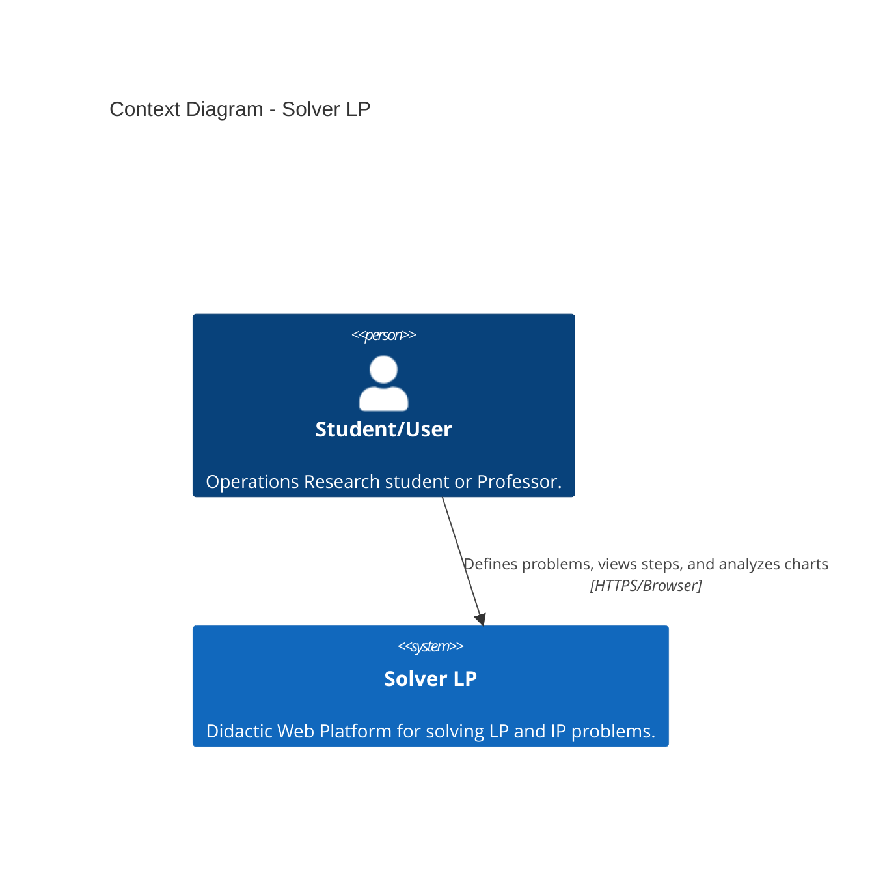
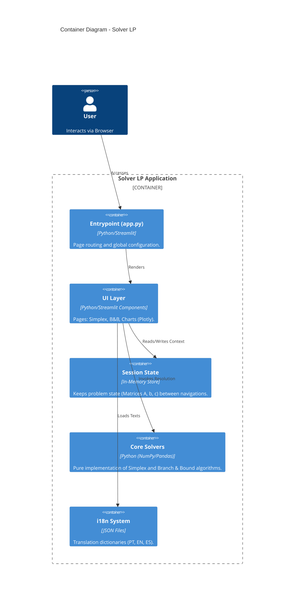
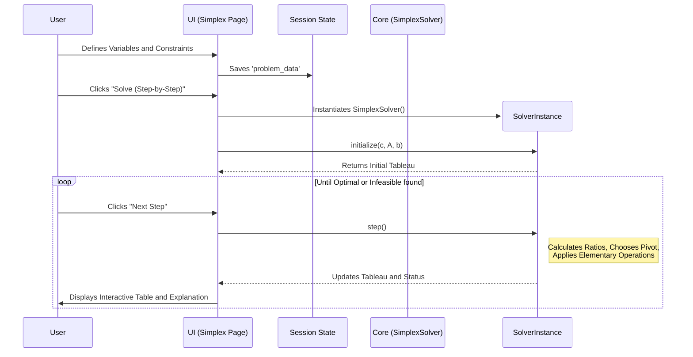

# Software Architecture Documentation - Solver LP

This document describes the architecture of the **Solver LP** system, detailing design decisions, code structure, and strategies adopted to meet the project's didactic and maintainability requirements.

---

## 1. Architecture Overview

The system follows a modular monolithic architecture, based on the **Model-View-Controller (MVC)** pattern adapted for the reactive flow of the Streamlit Framework.

*   **Model (Core)**: Pure mathematical logic and algorithms (Solvers).
*   **View (UI)**: Pages and visual components that consume the Model.
*   **Controller (App)**: Implicitly managed by Streamlit and the `app.py` file, which orchestrates navigation and global state.

---

## 2. Architecture Diagrams (C4 Model)

### 2.1. Level 1: Context Diagram (Macro)
The overview of how the user interacts with the system.



### 2.2. Level 2: Container Diagram (Logical Architecture)
Detailing of the main containers and technologies.



### 2.3. Level 3: Micro View (Simplex Execution Flow)
How the UI component interacts with the Core to ensure "White-Box" didactics.



---

## 3. Strategic Architecture Decisions

### 3.1. "White-Box" Algorithmic Implementation
**Decision:** Do not use commercial or high-performance solver libraries (such as `scipy.optimize`, `pulp`, `gurobipy`) for the main resolution logic. Instead, implement the **Simplex** and **Branch & Bound** algorithms from scratch using only `NumPy` for basic vector operations.

*   **Necessity (Why?)**: The goal of the TCC is didactic. Ready-made libraries function as "Black Boxes"; they receive the input and return the final optimized result, hiding intermediate steps (tableaux, pivots, tree cuts).
*   **Advantage**: By implementing the logic manually, we have full control over the internal state at each iteration, allowing us to extract and display granular data (pivot element, basic variables, reduced costs) which are essential for student learning.

### 3.2. Adoption of Streamlit
**Decision:** Use the **Streamlit** framework for Fullstack development (Frontend + Backend in pure Python).

*   **Necessity**: Rapid prototyping and focus on mathematical logic, minimizing the overhead of complex web development (React/Vue + REST API).
*   **Advantage**: Streamlit simplifies the management of interactive widgets and complex chart plotting (via native integration with **Plotly**), allowing the creation of a rich and reactive interface with fewer lines of code.

### 3.3. Open Internationalization Architecture (i18n)
**Decision:** Translation system based on external JSON files (`ui/locales/*.json`) loaded dynamically, rather than hardcoded strings or complex `gettext` libraries.

*   **Necessity**: As an educational Open Source project, the barrier to contribution should be minimal.
*   **Advantage**: Anyone can add a new language (e.g., French) simply by copying the `en.json` file to `fr.json` and translating the values. The system automatically detects and lists the new language in the menu.

### 3.4. Volatile State Persistence (Session State)
**Decision:** Intensive use of `st.session_state` to keep the problem context active while the user navigates between different tools (from Simplex to Duality, etc.).

*   **Advantage**: Eliminates the need for a relational database for standard usage, simplifying architecture and deployment. The history is kept in memory during the session and can be persisted locally by the user via JSON Download/Upload if necessary.

---

## 4. Folder Structure and Code Organization

The structure was designed to decouple the interface from the mathematical logic, facilitating testing and maintenance.

```
solver_pl/
├── app.py                  # [Controller] Entrypoint. Manages routes, sidebar menu, and global config.
├── requirements.txt        # Minimal dependencies (streamlit, numpy, pandas, plotly).
├── core/                   # [Model] Pure Logic Layer (UI Independent)
│   ├── simplex_solver.py       # SimplexSolver Class (Tableau logic, Big-M, Two-Phase)
│   └── branch_bound_solver.py  # BranchBoundSolver Class (Node tree management)
├── ui/                     # [View] Presentation Layer
│   ├── locales/                # Translation JSON files (pt.json, en.json, etc.)
│   ├── branch_and_bound_page.py # Visual interface for B&B tree
│   ├── duality_page.py         # Primal-Dual converter and Dual resolution
│   ├── helpers.py              # Shared utility functions
│   ├── history_page.py         # Interface for solved problems history
│   ├── home_page.py            # Landing page and main dashboard
│   ├── lang.py                 # Internationalization state management
│   ├── library_page.py         # Classic problems library
│   ├── plots.py                # Plotly chart generation (2D/3D)
│   ├── sensitivity_page.py     # Sensitivity analysis (shadow prices, intervals)
│   ├── simplex_page.py         # Simplex input and output interface
│   ├── standard_form_page.py   # Standard Form converter
│   └── tableau_display.py      # Tableau rendering component
└── images/                 # Static assets (Logo, Favicon)
```

---

## 5. Technologies Used

| Technology | Function in Project | Motivation |
| :--- | :--- | :--- |
| **Python 3.10+** | Main Language | Standard language for Data Science and Operations Research. |
| **Streamlit** | Web Framework | Rapid development of interactive data apps. |
| **NumPy** | Numerical Processing | Efficiency in linear algebra matrix and vector operations. |
| **Pandas** | Data Structuring | Tabular display and manipulation (Dataframes) in UI. |
| **Plotly** | Data Visualization | Interactive and responsive 2D and 3D charts. |
| **ST-Link-Analysis** | Graph Visualization | Specialized rendering of the Branch & Bound tree. |
